# openkey-cps2

* [Overview](#overview)
* [Project Status](#project-status)
* [Supported Games](#supported-games)
* [Hardware](#hardware)
   * [PCB Manufacturing](#pcb-manufacturing)
   * [BOM](#bom)
   * [Assembly](#assembly)
* [Programming](#programming)
  * [Hardware](#hardware-1)
  * [Software](#software)
  * [Testing](#testing)
* [Installation](#installation)
  * [93646B-3](#93646b-3)
  * [93646B-4](#93646b-4)
  * [93646B-5](#93646b-5)
  * [93646B-6](#93646b-6)
  * [93646B-7](#93646b-7)
  * [97691A-3 (all in one)](#97691a-3-all-in-one)
  * [97691A-4 (all in one)](#97691a-4-all-in-one)

## Overview
This is an opensource/hardware implementation of an on the fly CPS2 key programmer that consists of a board thats soldered onto the CPS2 B board or the CPS2 all-in-one boards.

**NOTE**: There is a typo on the silkscreen on hardware revision 2022-12-17.  The bypass cap is listed as being 100uf, when it should be 100nf.  This typo was fixed in hardware revision 2023-01-03, however the pictures below are all from the typo'd 2022-12-17 revision.

Individual boards: 
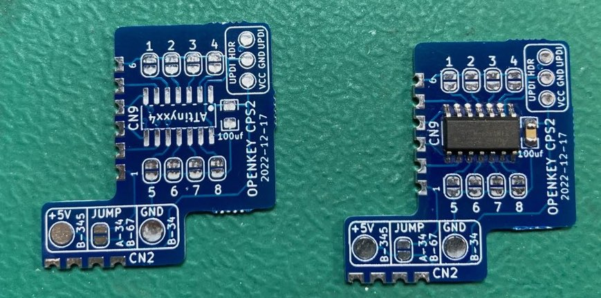

Panel: 
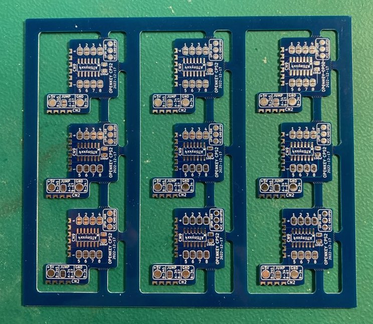

Details on *how* to program a CPS2 key data can be found in [Eduardo Cruz](http://arcadehacker.blogspot.com/)'s [write up](http://arcadehacker.blogspot.com/2016/09/capcom-cps2-security-programming-guide.html) and associated [firmware](https://github.com/ArcadeHacker/ArcadeHacker_CPS2).

Details on *what* to program can be found in MAME's [CPS2 driver](https://github.com/mamedev/mame/blob/master/src/mame/capcom/cps2.cpp) (the *.key files).

## Project Status
**PCB:** I would consider the design PCB done at this point.  I'm open to any input on changes/improvements as this is my first PCB design.

**Firmware:** Should be fulling working but more testing would be nice.  There are a lot of CPS2 games/keys.

**Documentation:** Work in progress

## Supported Games
**IMPORTANT**: You will want to program the ATtiny before soldering your game jumpers.  Specifically jumper #5 is also the programming pin on the ATtiny.  Jumping it will tie the pin to ground which will make programming impossible.

| Jumper 1234&nbsp;5678 | Program ROM Labels | Mame Rom Set | Game Names |
|:---------------:|:-------------|:------------|:-----------|
| 0000&nbsp;0000 | nffe | 1944 | 1944: The Loop Master (Euro 000620) |
| 0000 0001 | nffj | 1944j | 1944: The Loop Master (Japan 000620) |
| 0000 0010 | nffu | 1944u | 1944: The Loop Master (USA 000620) |
| 0000 0011 | 19xe | 19xx | 19XX: The War Against Destiny (Euro 960104) |
| 0000 0100 | 09xa 19xa | 19xxa 19xxar1 | 19XX: The War Against Destiny (Asia 960104) 19XX: The War Against Destiny (Asia 951207) |
| 0000 0101 | 19xb | 19xxb | 19XX: The War Against Destiny (Brazil 951218) |
| 0000 0110 | 19xh | 19xxh | 19XX: The War Against Destiny (Hispanic 951218) |
| 0000 0111 | 19xj-03b 19xj 19xj | 19xxj 19xxjr1 19xxjr2 | 19XX: The War Against Destiny (Japan 960104, yellow case) 19XX: The War Against Destiny (Japan 951225) 19XX: The War Against Destiny (Japan 951207) |
| 0000 1000 | 19xu | 19xxu | 19XX: The War Against Destiny (USA 951207) |
| 0000 1001 | pwge pwge | armwar armwarr1 | Armored Warriors (Euro 941024) Armored Warriors (Euro 941011) |
| 0000 1010 | pwga pwga | armwara armwarar1 | Armored Warriors (Asia 941024) Armored Warriors (Asia 940920) |
| 0000 1011 | pwgb | armwarb | Armored Warriors (Brazil 941024) |
| 0000 1100 | pwgu pwgu | armwaru armwaru1 | Armored Warriors (USA 941024) Armored Warriors (USA 940920) |
| 0000 1101 | avpe | avsp | Alien vs. Predator (Euro 940520) |
| 0000 1110 | avpa | avspa | Alien vs. Predator (Asia 940520) |
| 0000 1111 | avph | avsph | Alien vs. Predator (Hispanic 940520) |
| 0001 0000 | avpj | avspj | Alien vs. Predator (Japan 940520) |
| 0001 0001 | avpu | avspu | Alien vs. Predator (USA 940520) |
| 0001 0010 | btce | batcir | Battle Circuit (Euro 970319) |
| 0001 0011 | btca | batcira | Battle Circuit (Asia 970319) |
| 0001 0100 | btcj | batcirj | Battle Circuit (Japan 970319) |
| 0001 0101 | tkoj | choko | Janpai Puzzle Choukou (Japan 010820) |
| 0001 0110 | csce csce | csclub csclub1 | Capcom Sports Club (Euro 971017) Capcom Sports Club (Euro 970722) |
| 0001 0111 | csca | cscluba | Capcom Sports Club (Asia 970722) |
| 0001 1000 | csch | csclubh | Capcom Sports Club (Hispanic 970722) |
| 0001 1001 | cscj cscj | csclubj csclubjy | Capcom Sports Club (Japan 970722) Capcom Sports Club (Japan 970722, yellow case) |
| 0001 1010 | cybe | cybots | Cyberbots: Fullmetal Madness (Euro 950424) |
| 0001 1011 | cybj | cybotsj | Cyberbots: Fullmetal Madness (Japan 950420) |
| 0001 1100 | cybu | cybotsu | Cyberbots: Fullmetal Madness (USA 950424) |
| 0001 1101 | dd2e dd2e dd2e dd2e | ddsom ddsomr1 ddsomr2 ddsomr3 | Dungeons & Dragons: Shadow over Mystara (Euro 960619) Dungeons & Dragons: Shadow over Mystara (Euro 960223) Dungeons & Dragons: Shadow over Mystara (Euro 960209) Dungeons & Dragons: Shadow over Mystara (Euro 960208) |
| 0001 1110 | dd2a dd2a | ddsoma ddsomar1 | Dungeons & Dragons: Shadow over Mystara (Asia 960619) Dungeons & Dragons: Shadow over Mystara (Asia 960208) |
| 0001 1111 | dd2b | ddsomb | Dungeons & Dragons: Shadow over Mystara (Brazil 960223) |
| 0010 0000 | dd2h | ddsomh | Dungeons & Dragons: Shadow over Mystara (Hispanic 960223) |
| 0010 0001 | dd2j dd2j dd2j | ddsomj ddsomjr1 ddsomjr2 | Dungeons & Dragons: Shadow over Mystara (Japan 960619) Dungeons & Dragons: Shadow over Mystara (Japan 960206) Dungeons & Dragons: Shadow over Mystara (Japan 960223) |
| 0010 0010 | dd2u dd2u | ddsomu ddsomur1 | Dungeons & Dragons: Shadow over Mystara (USA 960619) Dungeons & Dragons: Shadow over Mystara (USA 960209) |
| 0010 0011 | dade dade | ddtod ddtodr1 | Dungeons & Dragons: Tower of Doom (Euro 940412) Dungeons & Dragons: Tower of Doom (Euro 940113) |
| 0010 0100 | dada dada | ddtoda ddtodar1 | Dungeons & Dragons: Tower of Doom (Asia 940412) Dungeons & Dragons: Tower of Doom (Asia 940113) |
| 0010 0101 | dadh dadh dadh | ddtodh ddtodhr1 ddtodhr2 | Dungeons & Dragons: Tower of Doom (Hispanic 940412) Dungeons & Dragons: Tower of Doom (Hispanic 940125) Dungeons & Dragons: Tower of Doom (Hispanic 940113) |
| 0010 0110 | dadj dadj dadj | ddtodj ddtodjr1 ddtodjr2 | Dungeons & Dragons: Tower of Doom (Japan 940412) Dungeons & Dragons: Tower of Doom (Japan 940125) Dungeons & Dragons: Tower of Doom (Japan 940113) |
| 0010 0111 | dadu dadu | ddtodu ddtodur1 | Dungeons & Dragons: Tower of Doom (USA 940125) Dungeons & Dragons: Tower of Doom (USA 940113) |
| 0010 1000 | gmde | dimahoo | Dimahoo (Euro 000121) |
| 0010 1001 | gmdu | dimahoou | Dimahoo (USA 000121) |
| 0010 1010 | vame | dstlk | Darkstalkers: The Night Warriors (Euro 940705) |
| 0010 1011 | vama | dstlka | Darkstalkers: The Night Warriors (Asia 940705) |
| 0010 1100 | vamh | dstlkh | Darkstalkers: The Night Warriors (Hispanic 940818) |
| 0010 1101 | vamu vamu | dstlku dstlkur1 | Darkstalkers: The Night Warriors (USA 940818) Darkstalkers: The Night Warriors (USA 940705) |
| 0010 1110 | uece | ecofghtr | Eco Fighters (World 931203) |
| 0010 1111 | ueca | ecofghtra | Eco Fighters (Asia 931203) |
| 0011 0000 | uech | ecofghtrh | Eco Fighters (Hispanic 931203) |
| 0011 0001 | uecu uecu | ecofghtru ecofghtru1 | Eco Fighters (USA 940215) Eco Fighters (USA 931203) |
| 0011 0010 | ggwu | gigawing | Giga Wing (USA 990222) |
| 0011 0011 | ggwa | gigawinga | Giga Wing (Asia 990222) |
| 0011 0100 | ggwb | gigawingb | Giga Wing (Brazil 990222) |
| 0011 0101 | ggwh | gigawingh | Giga Wing (Hispanic 990222) |
| 0011 0110 | ggwj | gigawingj | Giga Wing (Japan 990223) |
| 0011 0111 | gmdj | gmahou | Great Mahou Daisakusen (Japan 000121) |
| 0011 1000 | hs2u | hsf2 | Hyper Street Fighter II: The Anniversary Edition (USA 040202) |
| 0011 1001 | hs2a | hsf2a | Hyper Street Fighter II: The Anniversary Edition (Asia 040202) |
| 0011 1010 | hs2j hs2j | hsf2j hsf2j1 | Hyper Street Fighter II: The Anniversary Edition (Japan 040202) Hyper Street Fighter II: The Anniversary Edition (Japan 031222) |
| 0011 1011 | majj | jyangoku | Jyangokushi: Haoh no Saihai (Japan 990527) |
| 0011 1100 | rm2u | megaman2 | Mega Man 2: The Power Fighters (USA 960708) |
| 0011 1101 | rm2a | megaman2a | Mega Man 2: The Power Fighters (Asia 960708) |
| 0011 1110 | rm2h | megaman2h | Mega Man 2: The Power Fighters (Hispanic 960712) |
| 0011 1111 | rcmu rcmu rcmu | mmancp2u mmancp2ur1 mmancp2ur2 | Mega Man: The Power Battle (CPS2, USA 951006, SAMPLE Version) Mega Man: The Power Battle (CPS2, USA 950926, SAMPLE Version) Mega Man: The Power Battle (CPS2, USA 950925, SAMPLE Version) |
| 0100 0000 | sys_rom1 | mmatrix | Mars Matrix: Hyper Solid Shooting (USA 000412) |
| 0100 0001 | mmxa | mmatrixa | Mars Matrix: Hyper Solid Shooting (Asia 000412) |
| 0100 0010 | mmxj | mmatrixj | Mars Matrix: Hyper Solid Shooting (Japan 000412) |
| 0100 0011 | mpne mpn_03a mpnj mpne mpnu | mpang mpanga mpangj mpangr1 mpangu | Mighty! Pang (Euro 001010) Mighty! Pang (Asia 001010) Mighty! Pang (Japan 001011) Mighty! Pang (Euro 000925) Mighty! Pang (USA 001010) |
| 0100 0100 | mshe | msh | Marvel Super Heroes (Euro 951024) |
| 0100 0101 | msha | msha | Marvel Super Heroes (Asia 951024) |
| 0100 0110 | mshb mshb | mshb mshbr1 | Marvel Super Heroes (Brazil 951117) Marvel Super Heroes (Brazil 951024) |
| 0100 0111 | mshh | mshh | Marvel Super Heroes (Hispanic 951117) |
| 0100 1000 | mshj mshj | mshj mshjr1 | Marvel Super Heroes (Japan 951117) Marvel Super Heroes (Japan 951024) |
| 0100 1001 | mshu | mshu | Marvel Super Heroes (USA 951024) |
| 0100 1010 | mvse | mshvsf | Marvel Super Heroes Vs. Street Fighter (Euro 970625) |
| 0100 1011 | mvsa mvsa | mshvsfa mshvsfa1 | Marvel Super Heroes Vs. Street Fighter (Asia 970625) Marvel Super Heroes Vs. Street Fighter (Asia 970620) |
| 0100 1100 | mvsb mvsb | mshvsfb mshvsfb1 | Marvel Super Heroes Vs. Street Fighter (Brazil 970827) Marvel Super Heroes Vs. Street Fighter (Brazil 970625) |
| 0100 1101 | mvsh | mshvsfh | Marvel Super Heroes Vs. Street Fighter (Hispanic 970625) |
| 0100 1110 | mvsj mvsj mvsj | mshvsfj mshvsfj1 mshvsfj2 | Marvel Super Heroes Vs. Street Fighter (Japan 970707) Marvel Super Heroes Vs. Street Fighter (Japan 970702) Marvel Super Heroes Vs. Street Fighter (Japan 970625) |
| 0100 1111 | mvsu mvsu | mshvsfu mshvsfu1 | Marvel Super Heroes Vs. Street Fighter (USA 970827) Marvel Super Heroes Vs. Street Fighter (USA 970625) |
| 0101 0000 | mvce mvce | mvsc mvscr1 | Marvel Vs. Capcom: Clash of Super Heroes (Euro 980123) Marvel Vs. Capcom: Clash of Super Heroes (Euro 980112) |
| 0101 0001 | mvca mvca | mvsca mvscar1 | Marvel Vs. Capcom: Clash of Super Heroes (Asia 980123) Marvel Vs. Capcom: Clash of Super Heroes (Asia 980112) |
| 0101 0010 | mvcb | mvscb | Marvel Vs. Capcom: Clash of Super Heroes (Brazil 980123) |
| 0101 0011 | mvch | mvsch | Marvel Vs. Capcom: Clash of Super Heroes (Hispanic 980123) |
| 0101 0100 | mvcj mvcj mvc_ja | mvscj mvscjr1 mvscjsing | Marvel Vs. Capcom: Clash of Super Heroes (Japan 980123) Marvel Vs. Capcom: Clash of Super Heroes (Japan 980112) Marvel Vs. Capcom: Clash of Super Heroes (Japan 980123) (Single PCB) |
| 0101 0101 | mvcu mvcu | mvscu mvscur1 | Marvel Vs. Capcom: Clash of Super Heroes (USA 980123) Marvel Vs. Capcom: Clash of Super Heroes (USA 971222) |
| 0101 0110 | vphe | nwarr | Night Warriors: Darkstalkers' Revenge (Euro 950316) |
| 0101 0111 | vpha | nwarra | Night Warriors: Darkstalkers' Revenge (Asia 950302) |
| 0101 1000 | vphb | nwarrb | Night Warriors: Darkstalkers' Revenge (Brazil 950403) |
| 0101 1001 | vphh | nwarrh | Night Warriors: Darkstalkers' Revenge (Hispanic 950403) |
| 0101 1010 | vphu | nwarru | Night Warriors: Darkstalkers' Revenge (USA 950406) |
| 0101 1011 | pcfj | pfghtj | Pocket Fighter (Japan 970904) |
| 0101 1100 | pwgj pwgj | pgear pgearr1 | Powered Gear: Strategic Variant Armor Equipment (Japan 941024) Powered Gear: Strategic Variant Armor Equipment (Japan 940916) |
| 0101 1101 | pgau | progear | Progear (USA 010117) |
| 0101 1110 | pgaa | progeara | Progear (Asia 010117) |
| 0101 1111 | pgaj | progearj | Progear no Arashi (Japan 010117) |
| 0110 0000 | pl2e pl2j pl2j | pzloop2 pzloop2j pzloop2jr1 | Puzz Loop 2 (Euro 010302) Puzz Loop 2 (Japan 010226) Puzz Loop 2 (Japan 010205) |
| 0110 0001 | tqzj | qndream | Quiz Nanairo Dreams: Nijiirochou no Kiseki (Japan 96086) |
| 0110 0010 | smbe | ringdest | Ring of Destruction: Slammasters II (Euro 940902) |
| 0110 0011 | smba | ringdesta | Ring of Destruction: Slammasters II (Asia 940831) |
| 0110 0100 | smbb smbh | ringdestb ringdesth | Ring of Destruction: Slammasters II (Brazil 940902) Ring of Destruction: Slammasters II (Hispanic 940902) |
| 0110 0101 | rcmj | rmancp2j | Rockman: The Power Battle (CPS2, Japan 950922) |
| 0110 0110 | rm2j | rockman2j | Rockman 2: The Power Fighters (Japan 960708) |
| 0110 0111 | sfze sfze sfze sfze | sfa sfar1 sfar2 sfar3 | Street Fighter Alpha: Warriors' Dreams (Euro 950727) Street Fighter Alpha: Warriors' Dreams (Euro 950718) Street Fighter Alpha: Warriors' Dreams (Euro 950627) Street Fighter Alpha: Warriors' Dreams (Euro 950605) |
| 0110 1000 | sz2e | sfa2 | Street Fighter Alpha 2 (Euro 960229) |
| 0110 1001 | sz2u sz2u | sfa2u sfa2ur1 | Street Fighter Alpha 2 (USA 960430) Street Fighter Alpha 2 (USA 960306) |
| 0110 1010 | sz3e | sfa3 | Street Fighter Alpha 3 (Euro 980904) |
| 0110 1011 | sz3b | sfa3b | Street Fighter Alpha 3 (Brazil 980629) |
| 0110 1100 | sz3h sz3h | sfa3h sfa3hr1 | Street Fighter Alpha 3 (Hispanic 980904) Street Fighter Alpha 3 (Hispanic 980629) |
| 0110 1101 | sz3u sz3u sz3-usam_03 | sfa3u sfa3ur1 sfa3us | Street Fighter Alpha 3 (USA 980904) Street Fighter Alpha 3 (USA 980629) Street Fighter Alpha 3 (USA 980616, SAMPLE Version) |
| 0110 1110 | sfzu | sfau | Street Fighter Alpha: Warriors' Dreams (USA 950627) |
| 0110 1111 | sz2a | sfz2a | Street Fighter Zero 2 (Asia 960227) |
| 0111 0000 | szaa szaa | sfz2al sfz2alr1 | Street Fighter Zero 2 Alpha (Asia 960826) Street Fighter Zero 2 Alpha (Asia 960805) |
| 0111 0001 | szab | sfz2alb | Street Fighter Zero 2 Alpha (Brazil 960813) |
| 0111 0010 | szah | sfz2alh | Street Fighter Zero 2 Alpha (Hispanic 960813) |
| 0111 0011 | szaj | sfz2alj | Street Fighter Zero 2 Alpha (Japan 960805) |
| 0111 0100 | sz2b sz2b | sfz2b sfz2br1 | Street Fighter Zero 2 (Brazil 960531) Street Fighter Zero 2 (Brazil 960304) |
| 0111 0101 | sz2h | sfz2h | Street Fighter Zero 2 (Hispanic 960304) |
| 0111 0110 | sz2j sz2j | sfz2j sfz2jr1 | Street Fighter Zero 2 (Japan 960430) Street Fighter Zero 2 (Japan 960227) |
| 0111 0111 | sz2n | sfz2n | Street Fighter Zero 2 (Oceania 960229) |
| 0111 1000 | sz3a sz3a | sfz3a sfz3ar1 | Street Fighter Zero 3 (Asia 980904) Street Fighter Zero 3 (Asia 980701) |
| 0111 1001 | sz3j sz3j sz3j | sfz3j sfz3jr1 sfz3jr2 | Street Fighter Zero 3 (Japan 980904) Street Fighter Zero 3 (Japan 980727) Street Fighter Zero 3 (Japan 980629) |
| 0111 1010 | sfza sfza | sfza sfzar1 | Street Fighter Zero (Asia 950627) Street Fighter Zero (Asia 950605) |
| 0111 1011 | sfzb sfzb | sfzb sfzbr1 | Street Fighter Zero (Brazil 951109) Street Fighter Zero (Brazil 950727) |
| 0111 1100 | sfzh sfzh | sfzh sfzhr1 | Street Fighter Zero (Hispanic 950718) Street Fighter Zero (Hispanic 950627) |
| 0111 1101 | sfzj sfzj sfzj | sfzj sfzjr1 sfzjr2 | Street Fighter Zero (Japan 950727) Street Fighter Zero (Japan 950627) Street Fighter Zero (Japan 950605) |
| 0111 1110 | pcfu | sgemf | Super Gem Fighter Mini Mix (USA 970904) |
| 0111 1111 | pcfa | sgemfa | Super Gem Fighter: Mini Mix (Asia 970904) |
| 1000 0000 | pcfh | sgemfh | Super Gem Fighter: Mini Mix (Hispanic 970904) |
| 1000 0001 | smbj smbj | smbomb smbombr1 | Super Muscle Bomber: The International Blowout (Japan 940831) Super Muscle Bomber: The International Blowout (Japan 940808) |
| 1000 0010 | pzfe | spf2t | Super Puzzle Fighter II Turbo (Euro 960529) |
| 1000 0011 | pzfa | spf2ta | Super Puzzle Fighter II Turbo (Asia 960529) |
| 1000 0100 | pzfh | spf2th | Super Puzzle Fighter II Turbo (Hispanic 960531) |
| 1000 0101 | pzfu | spf2tu | Super Puzzle Fighter II Turbo (USA 960620) |
| 1000 0110 | pzfj | spf2xj | Super Puzzle Fighter II X (Japan 960531) |
| 1000 0111 | ssfe ssfe | ssf2 ssf2r1 | Super Street Fighter II: The New Challengers (World 931005) Super Street Fighter II: The New Challengers (World 930911) |
| 1000 1000 | ssfa ssfa | ssf2a ssf2ar1 | Super Street Fighter II: The New Challengers (Asia 931005) Super Street Fighter II: The New Challengers (Asia 930914) |
| 1000 1001 | ssfh | ssf2h | Super Street Fighter II: The New Challengers (Hispanic 930911) |
| 1000 1010 | ssfj ssfj ssfj | ssf2j ssf2jr1 ssf2jr2 | Super Street Fighter II: The New Challengers (Japan 931005) Super Street Fighter II: The New Challengers (Japan 930911) Super Street Fighter II: The New Challengers (Japan 930910) |
| 1000 1011 | ssfh | ssf2t | Super Street Fighter II Turbo (World 940223) |
| 1000 1100 | sfxa | ssf2ta | Super Street Fighter II Turbo (Asia 940223) |
| 1000 1101 | ssfe ssfe | ssf2tb ssf2tbr1 | Super Street Fighter II: The Tournament Battle (World 931119) Super Street Fighter II: The Tournament Battle (World 930911) |
| 1000 1110 | ssfa | ssf2tba | Super Street Fighter II: The Tournament Battle (Asia 931005) |
| 1001 0000 | ssftj ssfj | ssf2tbj ssf2tbj1 | Super Street Fighter II: The Tournament Battle (Japan 931005) Super Street Fighter II: The Tournament Battle (Japan 930911) |
| 1001 0001 | ssfu | ssf2tbu | Super Street Fighter II: The Tournament Battle (USA 930911) |
| 1001 0010 | sfxh | ssf2th | Super Street Fighter II Turbo (Hispanic 940223) |
| 1001 0011 | sfxu sfxu | ssf2tu ssf2tur1 | Super Street Fighter II Turbo (USA 940323) Super Street Fighter II Turbo (USA 940223) |
| 1001 0100 | ssfu ssfu | ssf2u ssf2us2 | Super Street Fighter II: The New Challengers (USA 930911)  |
| 1001 0101 | sfxj sfxj | ssf2xj ssf2xjr1 | Super Street Fighter II X: Grand Master Challenge (Japan 940311) Super Street Fighter II X: Grand Master Challenge (Japan 940223) |
| 1001 0110 | sfxo | ssf2xjr1r | Super Street Fighter II X: Grand Master Challenge (Japan 940223 rent version) |
| 1001 0111 | uecj | uecology | Ultimate Ecology (Japan 931203) |
| 1001 1000 | vamj vamj vamj | vampj vampja vampjr1 | Vampire: The Night Warriors (Japan 940705) Vampire: The Night Warriors (Japan 940705 alt) Vampire: The Night Warriors (Japan 940630) |
| 1001 1001 | vh2j vh2j | vhunt2 vhunt2r1 | Vampire Hunter 2: Darkstalkers Revenge (Japan 970929) Vampire Hunter 2: Darkstalkers Revenge (Japan 970913) |
| 1001 1010 | vphj vphj vphjstop vphj | vhuntj vhuntjr1 vhuntjr1s vhuntjr2 | Vampire Hunter: Darkstalkers' Revenge (Japan 950316) Vampire Hunter: Darkstalkers' Revenge (Japan 950307) Vampire Hunter: Darkstalkers' Revenge (Japan 950307 stop version) Vampire Hunter: Darkstalkers' Revenge (Japan 950302) |
| 1001 1011 | vm3e | vsav | Vampire Savior: The Lord of Vampire (Euro 970519) |
| 1001 1100 | vs2j | vsav2 | Vampire Savior 2: The Lord of Vampire (Japan 970913) |
| 1001 1101 | vm3a | vsava | Vampire Savior: The Lord of Vampire (Asia 970519) |
| 1001 1110 | vm3b | vsavb | Vampire Savior: The Lord of Vampire (Brazil 970519) |
| 1001 1111 | vm3h | vsavh | Vampire Savior: The Lord of Vampire (Hispanic 970519) |
| 1010 0000 | vm3j | vsavj | Vampire Savior: The Lord of Vampire (Japan 970519) |
| 1010 0001 | vm3u | vsavu | Vampire Savior: The Lord of Vampire (USA 970519) |
| 1010 0010 | xmne xmne | xmcota xmcotar1 | X-Men: Children of the Atom (Euro 950331) X-Men: Children of the Atom (Euro 950105) |
| 1010 0011 | xmna xmna xmna | xmcotaa xmcotaar1 xmcotaar2 | X-Men: Children of the Atom (Asia 950105) X-Men: Children of the Atom (Asia 941219) X-Men: Children of the Atom (Asia 941217) |
| 1010 0100 | xmnb | xmcotab | X-Men: Children of the Atom (Brazil 950331) |
| 1010 0101 | xmnh xmnh | xmcotah xmcotahr1 | X-Men: Children of the Atom (Hispanic 950331) X-Men: Children of the Atom (Hispanic 950105) |
| 1010 0110 | xmnj xmnj xmnj xmnj xmno | xmcotaj xmcotaj1 xmcotaj2 xmcotaj3 xmcotajr | X-Men: Children of the Atom (Japan 950105) X-Men: Children of the Atom (Japan 941222) X-Men: Children of the Atom (Japan 941219) X-Men: Children of the Atom (Japan 941217) X-Men: Children of the Atom (Japan 941208 rent version) |
| 1010 0111 | xmnu | xmcotau | X-Men: Children of the Atom (USA 950105) |
| 1010 1000 | xvse xvse | xmvsf xmvsfr1 | X-Men Vs. Street Fighter (Euro 961004) X-Men Vs. Street Fighter (Euro 960910) |
| 1010 1001 | xvsa xvsa xvsa xvsa | xmvsfa xmvsfar1 xmvsfar2 xmvsfar3 | X-Men Vs. Street Fighter (Asia 961023) X-Men Vs. Street Fighter (Asia 961004) X-Men Vs. Street Fighter (Asia 960919) X-Men Vs. Street Fighter (Asia 960910) |
| 1010 1010 | xvsb | xmvsfb | X-Men Vs. Street Fighter (Brazil 961023) |
| 1010 1011 | xvsh | xmvsfh | X-Men Vs. Street Fighter (Hispanic 961004) |
| 1010 1100 | xvsj xvsj xvsj xvsj | xmvsfj xmvsfjr1 xmvsfjr2 xmvsfjr3 | X-Men Vs. Street Fighter (Japan 961023) X-Men Vs. Street Fighter (Japan 961004) X-Men Vs. Street Fighter (Japan 960910) X-Men Vs. Street Fighter (Japan 960909) |
| 1010 1101 | xvsu xvsu xvsu | xmvsfu xmvsfur1 xmvsfur2 | X-Men Vs. Street Fighter (USA 961023) X-Men Vs. Street Fighter (USA 961004) X-Men Vs. Street Fighter (USA 960910) |
| 1010 1110 | | | Phoenix Key (0xff filled) |

## Hardware
### PCB Manufacturing
For thickness I've been using 1mm, but standard 1.6mm will work fine too.

The board has 2 sets of castellated holes (through holes cut in half on the edge of the board).  When ordering make sure you pick the option for castellated holes as they require special processing.  If you don't pick the option, your castellated holes will likely be mangled and look like this

**Mangled Castellated Holes** 
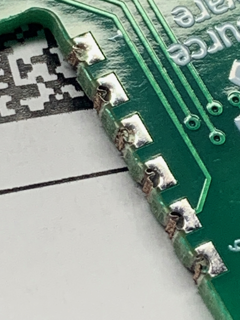

I've been using [jlcpcb](https://jlcpcb.com/) for PCB manufacturing.  For them, picking castellated holes adds around a $40 fee to the order.  They also seem to have an unwritten limit of 30 PCBs per order that have castellated holes.  If you go above this they may reject your order or ask you if its ok to remove the castellated holes option (don't do it!).

If you want more then 30 PCBs, I would just use the panel version openkey-cps2 which has 9 PCBs (3x3) on each panel.  Each panel is considered a PCB, so you can get up to 9 * 30 openkey-cps2 boards.  Thats way more then anyone would ever need, but to does get the price per board way down.

### BOM
| Description | Part Number | DigiKey | Mouser | Notes |
|-------------|-------------|---------|--------|-------|
| ATtiny404 20Mhz | ATTINY404-SSN | [ATTINY404-SSN-ND](https://www.digikey.com/en/products/detail/microchip-technology/ATTINY404-SSN/9947546) | [556-ATTINY404-SSNR](https://www.mouser.com/ProductDetail/Microchip-Technology-Atmel/ATTINY404-SSNR?qs=F5EMLAvA7IAEqD7Aw0z%252B9Q%3D%3D) | Other ATtiny tinyAVR 0/1/2-series models should be viable as well.  The code compiles to a little over 3K in size, so any that have 4K or more of flash should work.  Just note I have only tested with 404s |
| 100nf / 0.1uf SMD Ceramic Capacitor 0805 Size | | | | |

### Assembly
Nothing special here just install the ATtiny and the bypass cap.

**IMPORTANT**: You will want to program the ATtiny before soldering your game jumpers.  Specifically jumper #5 is also the programming pin on the ATtiny.  Jumping it will tie the pin to ground which will make programming impossible.

## Programming
### Hardware
Programming is done with a UPDI programmer.  I've been using this one:

[Serial UPDI Programmer for ATmega 0-Series, or ATtiny 0-Series or 1-Series, or AVR DA or AVR DB](https://www.amazon.com/dp/B09X64YRLD?psc=1&ref=ppx_yo2ov_dt_b_product_details)

Note: This programmer (and likely others) has a switch for 3.3V and 5V.  Set it to 5V.

The openkey-cps2 programming port consists of 3x pads (VCC, GND, UPDI) that will need to be connected to the programmer.  I've been using a short 3 pin female to female IDC cable with [pogo pins](https://www.amazon.com/dp/B00X7C8PGE?psc=1&ref=ppx_yo2ov_dt_b_product_details) on one end to do this.  Additionally you could probably use something like [this](https://www.amazon.com/dp/B09MGG4C6X?ref=ppx_yo2ov_dt_b_product_details&th=1) if you are going to be programming a bunch.

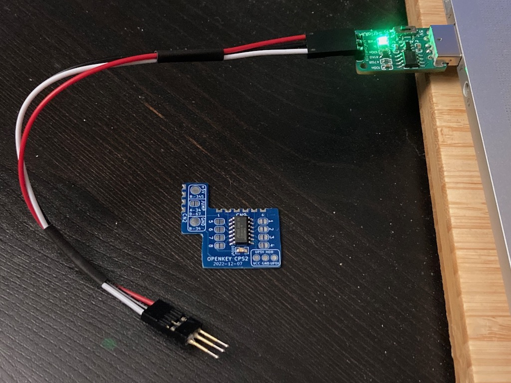

Of course be sure you properly orient the board so the labeled pads match up.  vcc to vcc, gnd to gnd, and updi to updi.

### Software
For software I've been using the [Arduino IDE](https://www.arduino.cc/en/software/OldSoftwareReleases) with [megaTinyCore](https://github.com/SpenceKonde/megaTinyCore), which adds support for tinyAVR 0/1/2-Series MCUs.

**NOTE**: The makers of megaTinyCore currently recommend using Arduino IDE version 1.8.13 for best compatibility.
 2.0 definitely does not work!

To install the megaTinyCore you, should just need to add http://drazzy.com/package_drazzy.com_index.json to "Addit
ional Boards Manager URLs" in the settings for the Arduino IDE.

From there you need to configure the board/programming settings.  I've been using these:

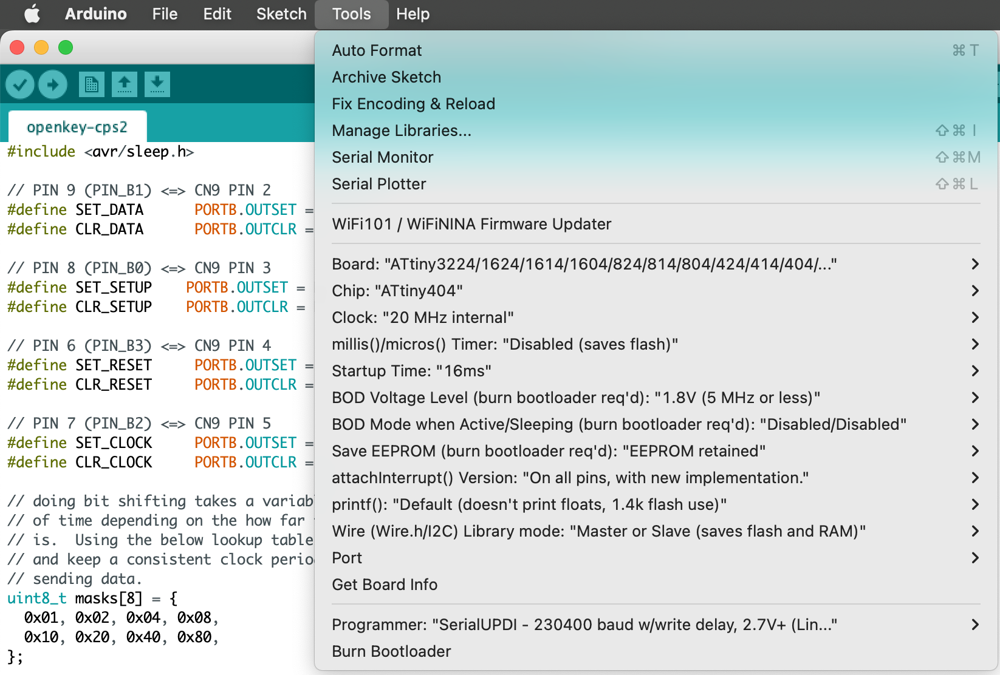

### Testing
If you are selling or giving away the openkey-cps2's that you have assembled/programmed its nice to be able to test them first.  This section explains how you can test the board without having to install it.

You will need to get your hands on a "1944: The Loop Master (Euro 000620)" in a 93646B-6 or 93646B-7 B board.  For mine I just made a conversion using the 1944 mame romset.  This specific game is needed because its game jumper 0000 0000.

Additionally you will need to create the following cable

Side A: 
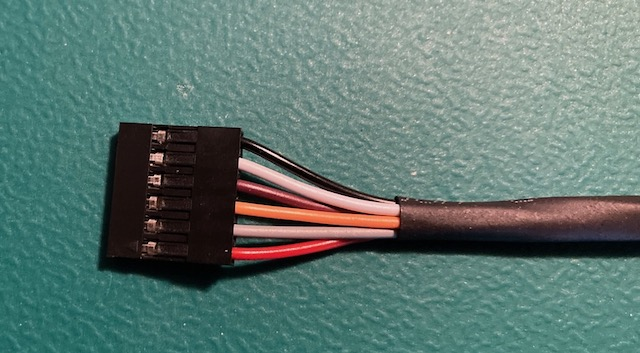

Side B: 
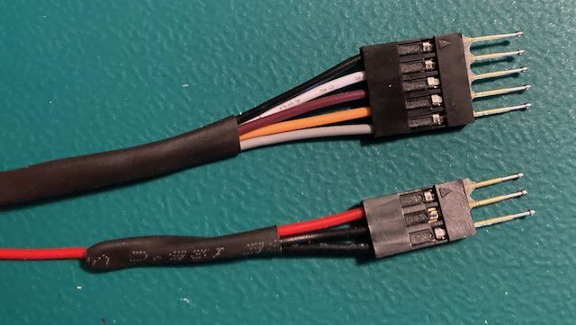

I would advise making this cable about 24 inches long.

You will note that side "A" is 6 pin female connectors, which break out into a 5 pin female connector and 3 pin female connector "B" side.  The "B" side then has pogo pins installed with super glue to keep them steady.  Additionally on the 3 pin female connector "B" side, pins 2 and 3 are just connected to each other.

The red wire is +5V, black wire is GND, remaining are data lines.

The "A" side 6 pin connector should be plugged into CN9 on the B board, with +5V on pin 1, and GND on pin 6 as shown.

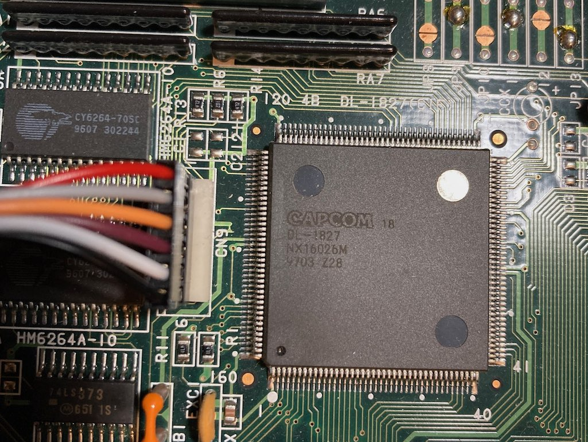

**IMPORTANT**: The +5V on the 3 pin female/pogo pin connector will be live when you power on the board, so be extra careful you don't touch anything with it or it could cause a short/damage.

CPS2 boards will hold onto the programmed key data for a while after they have been powered off.  So to properly test the openkey-cps2 its best to program the wrong key, verify it breaks the game, then program the correct key to verify it works.

**Programming the WRONG key**
1. Power on the CPS2 board
2. Connect the 5 pogo pin connector to pins 2-6 of CN9 on the openkey-cps2
3. Connect the 3 pogo pin connector to the UPDI header on openkey-cps2, with the red wire connected to VCC pad, and the pins 2-3 connected to GND and UPDI pads

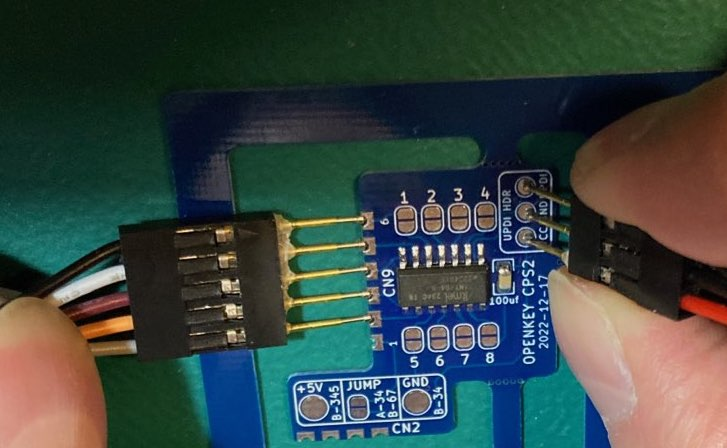

This should result is a solid color screen, mine is normally purple.

The UPDI pad on the UPDI header is shared with jumper #5 of the game select.  By jumping the GND and UPDI pads together its cause the MCU to program game 0000 1000 or 19XX: The War Against Destiny (USA 951207), which is the wrong key for 1944: The Loop Master (Euro 000620)

**Programming the CORRECT key**
1. Remove both the 5 pogo pin and 3 pogo pin connectors from the openkey-cps2 board
2. Connect the 5 pogo pin connector to pins 2-6 of CN9 on the openkey-cps2
3. Using the 3 pogo pin connector, only connect the red wire pogo pin to the VCC pad on the UPDI header.  Do not connect anything to the GND and UPDI pads

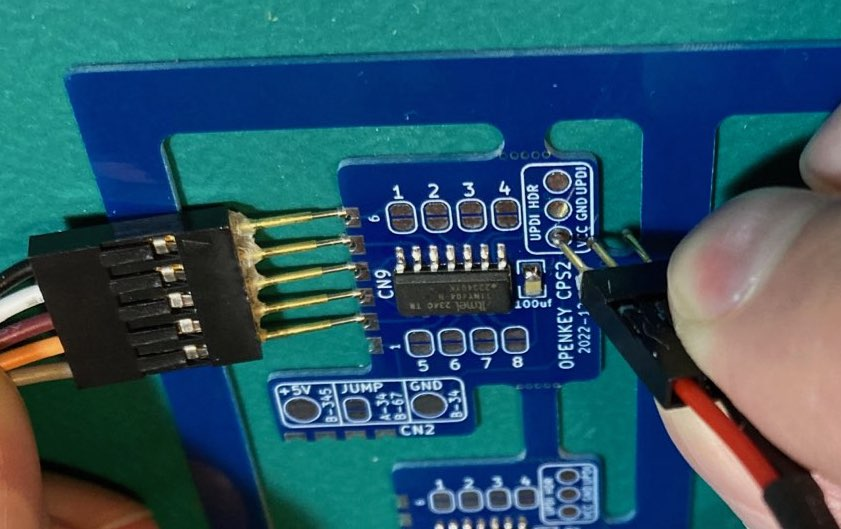

By only applying +5V on the VCC pad on UPDI header and NOT jumping the GND/UPDI pads it will cause the MCU to program game 0000 0000.

The game should boot a few seconds later

You do not need to power off the CPS2 board in between programming the wrong/correct key or even between testing multiple openkey-cps2 board.  Part of the programming process will reset the game.

## Installation
Below are pictures for installing openkey-cps2 on the different cps2 board revisions.  

You will notice there are 3 boxes on the board, 2 with solder pads (+5V and GND), and 1 jumper.  Within the box is a short hand version of which board revisions need which of them.

  * +5V has **B-345** which means its needed for revisions 93646**B-3**, 93646**B-4**, and 93646**B-5**
  * JUMP has **B-67** and **A-34** which means it needs to be jumped for revisions 93646**B-6**, 93646**B-7**, 97691**A-3** and 97691**A-4**
  * GND has **B-34** which means its needed for revisions 93646**B-3** and 93646**B-4**

### **93646B-3**
### **93646B-4**
---
93646B-3 and 93646B-4 have the same install process.

Identify CN2 on the top side of the CPS2 B Board PCB.  This is where openkey-cps2 will be installed.

Your board will likely have the resistor shown in the below picture.
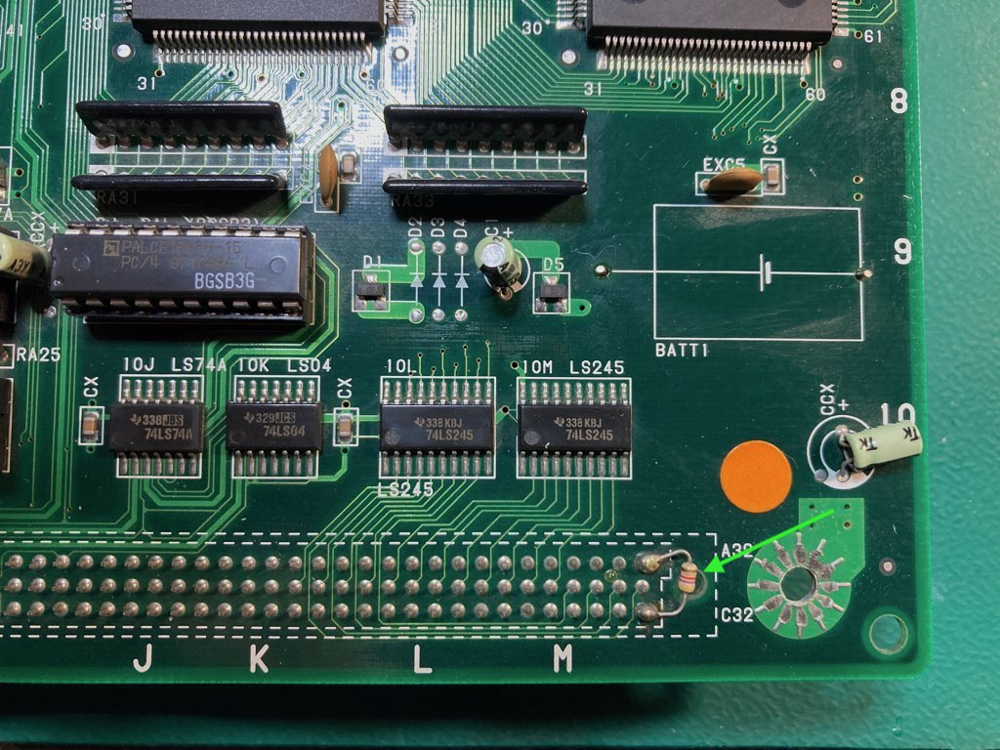

Temporarily desolder the top connection of the resistor, move it out of the way and install openkey-cps2 as shown below.  Additionally make note of the red and green arrows/lines as these will be the locations we wire up for +5V and GND.

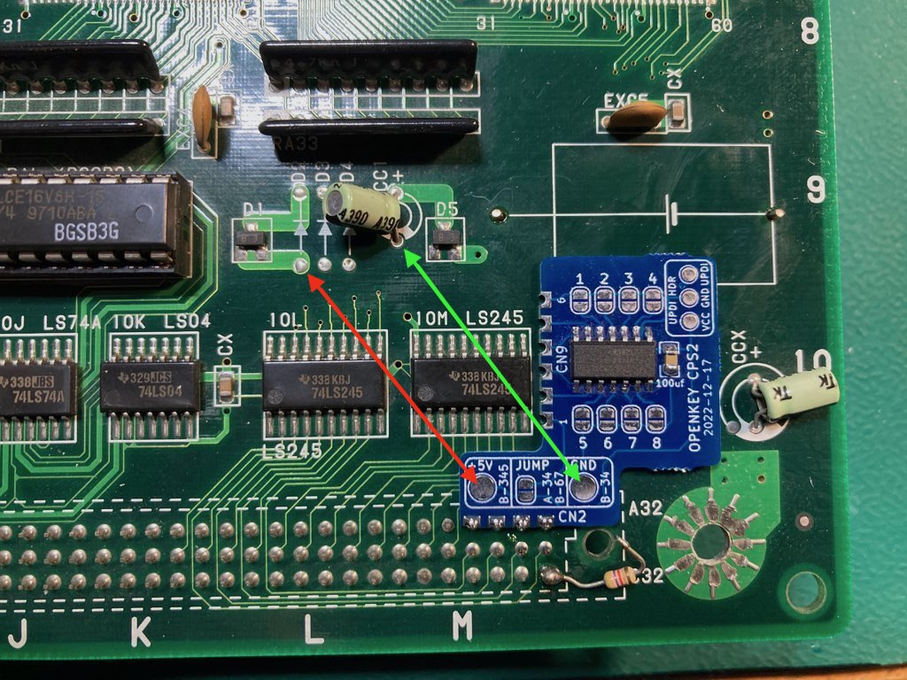

Re-solder the resistor and wire up the +5V and GND wires as shown below.  Then jumper 1 to 8 based on which game you need. 

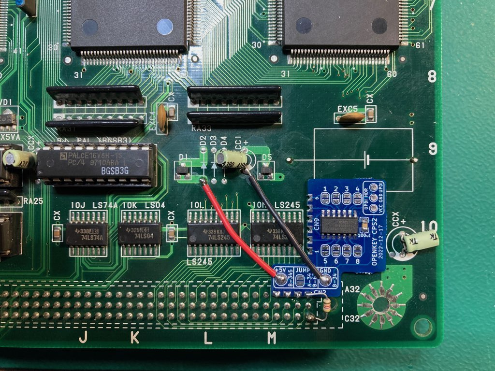

### **93646B-5**
---
NOTE: I don't have a 93646B-5, but this is what should be required for the installation.

Identify CN9 on the top side of the CPS2 B Board PCB.  The underside of CN9 is what we will be installing openkey-cps2 to.

Top:

Bottom:

Solder the castellated holes on CN9 of openkey-cps2 to the underside pins for CN9 on the CPS2 PCB.  Additionally solder a wire going from the +5V pad on the openkey-cps2 to RA2 pin 1 as seen below.  Then jumper 1 to 8 based on which game you need.  

Installed:
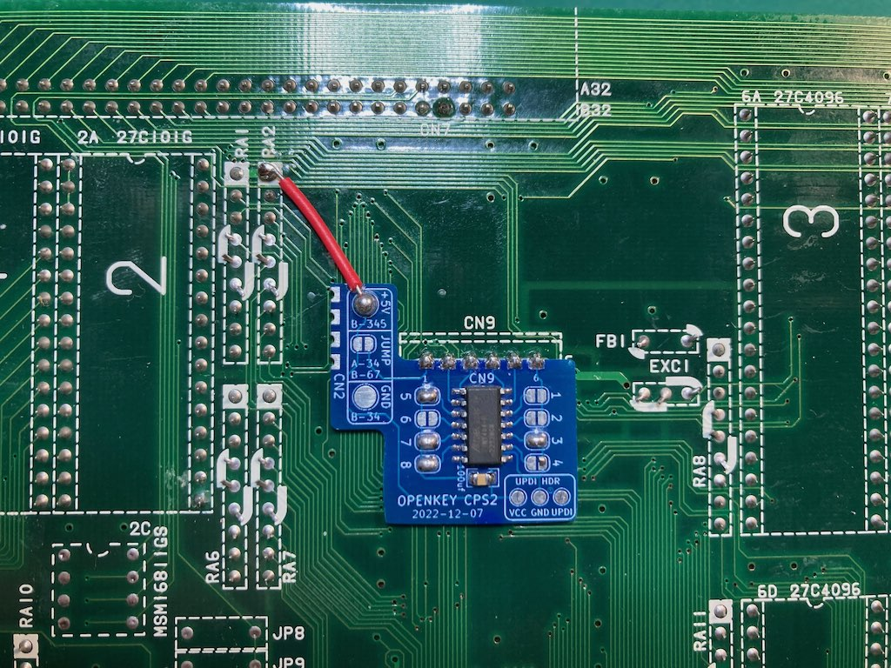

### **93646B-6**
### **93646B-7**
---
93646B-6 and 93646B-7 have the same install process.

Identify CN9 on the top side of the CPS2 B Board PCB.  The underside of CN9 is what we will be installing openkey-cps2 to.

Top:

Bottom:

Solder the castellated holes on CN9 of openkey-cps2 to the underside pins for CN9 on the CPS2 PCB.  Additionally jumper the **JUMP** pad as pointed out by the green arrow in the picture below.  Then jumper 1 to 8 based on which game you need.  

Installed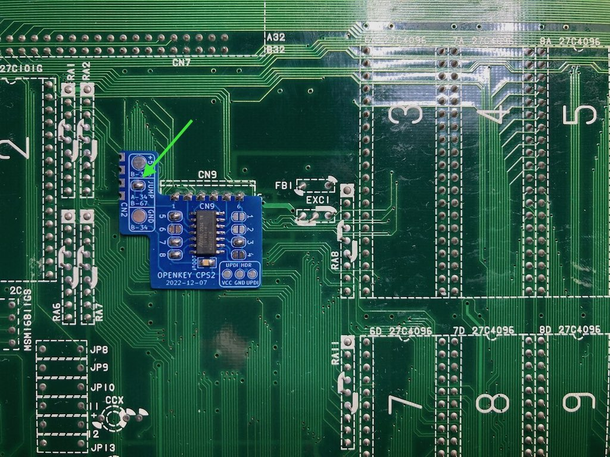

### **97691A-3 (all in one)**
### **97691A-4 (all in one)**
---
97691A-3 and 97691A-4 have the same install process.

Identify CN1 on the top side of the CPS2 PCB.  It should be next to the memory socket in the corner.  The underside of CN1 is what we will be installing openkey-cps2 to.

Top:
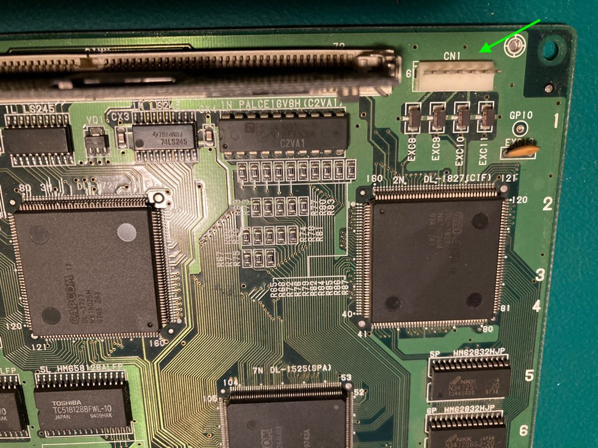

Bottom:
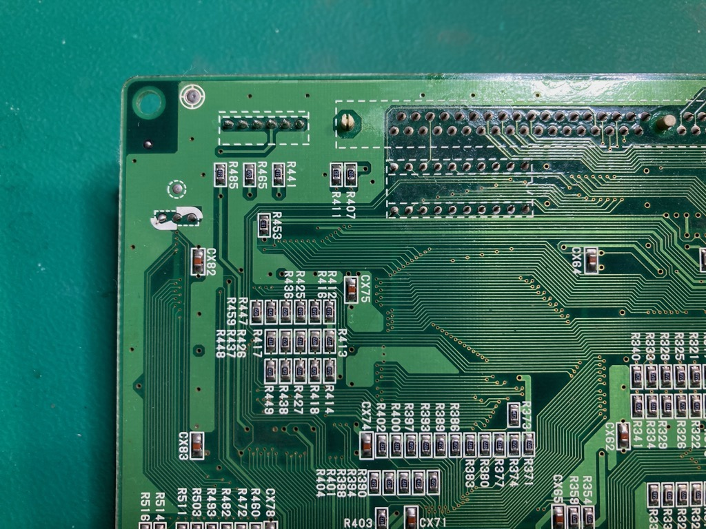

openkey-cps2 will sit on top of those 4 resistors seen in the above picture.  Solder the castellated holes on CN9 of openkey-cps2 to the underside pins for CN1 on the CPS2 PCB.  Additionally jumper the **JUMP** pad as pointed out by the green arrow in the picture below.  Then jumper 1 to 8 based on which game you need.  

Installed:
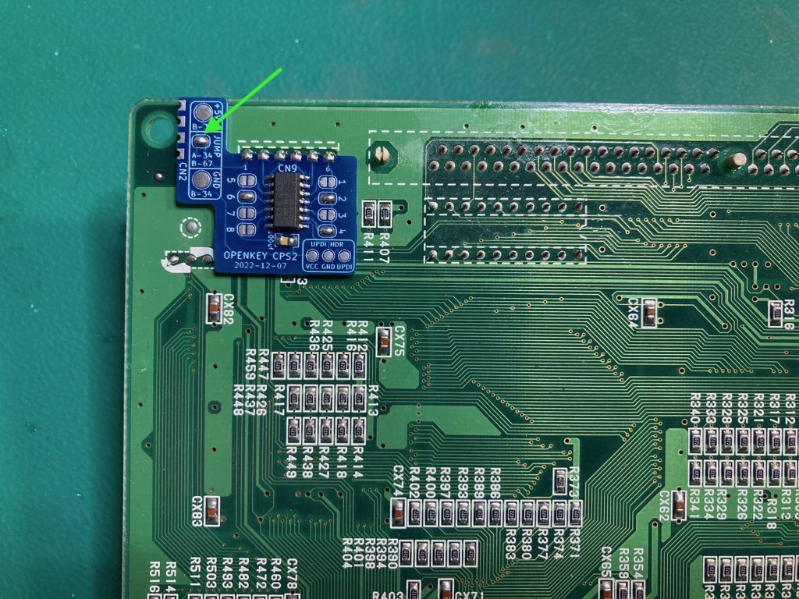